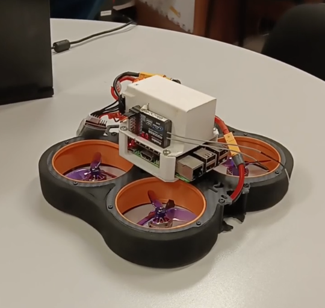
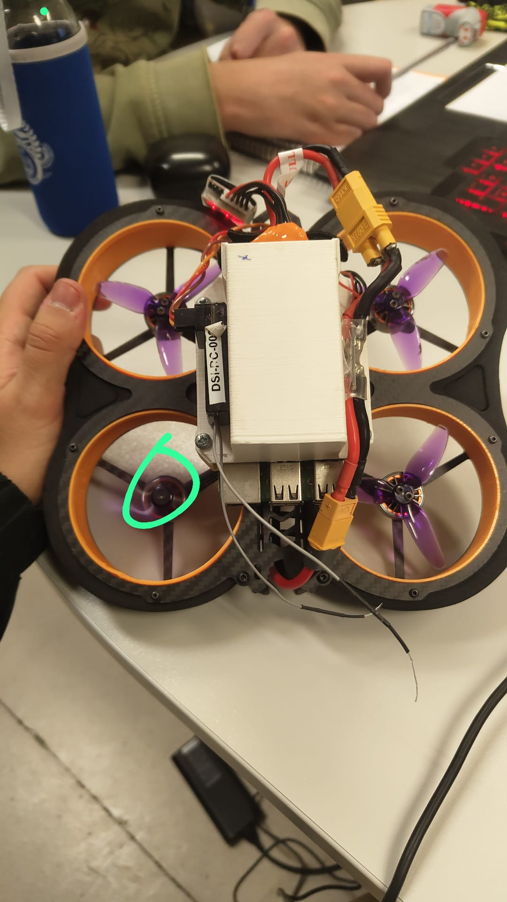

# Dron-Firefly 🚁✨

Dron-Firefly is an embedded real-time system project focused on developing and programming a drone using a Raspberry Pi and a Navio board. 🚁✨

<p align="center">
  
</p>

---

## 🛠️ Project Overview

This project is structured into four main modules:

- **Motors**: Manages the control and operation of the drone's motors.
- **Controller**: Oversees flight dynamics and stability.
- **PID**: Implements Proportional-Integral-Derivative control algorithms for precise maneuvering.
- **Sensors**: Integrates various sensors for real-time data acquisition.

---

## 🔧 Technologies & Tools

- **Programming Language**: C++
- **Hardware**:
  - Raspberry Pi
  - Navio
- **Libraries**:
  - Navio's native libraries
  - [RTIMULib](https://github.com/Richard-Tech/RTIMULib) for sensor data filtering using a Kalman filter
- **Communication Protocol**: [Zenoh](https://zenoh.io/)

---

## 🚀 Features

- **Real-Time Embedded System**: Ensures timely and deterministic responses for drone operations.
- **Sensor Fusion**: Utilizes Kalman filtering for accurate sensor data interpretation.
- **PID Control**: Provides stable and responsive flight control.
- **Remote Communication**: Employs Zenoh for efficient data exchange.

---

## 📸 Visuals

<p align="center">
  
</p>

---

## 📝 Setup & Installation

1. **Hardware Assembly**:
   - Attach the Navio board to the Raspberry Pi.
   - Connect the motors and sensors as per the hardware specifications.

2. **Software Configuration**:
   - Clone this repository:
     ```bash
     git clone https://github.com/IagoPorto/Dron-Firefly.git
     ```
   - Install the necessary dependencies:
     ```bash
     sudo apt-get install -y rtimulib zenoh
     ```
   - Configure RTIMULib by editing the `RTIMULib.ini` file to match your sensor setup.

3. **Compilation**:
   - Navigate to the project directory:
     ```bash
     cd Dron-Firefly
     ```
   - Compile the code:
     ```bash
     make
     ```

4. **Execution**:
   - Run the main program:
     ```bash
     ./dron_firefly
     ```

---

Thank you for exploring Dron-Firefly! 🛫
